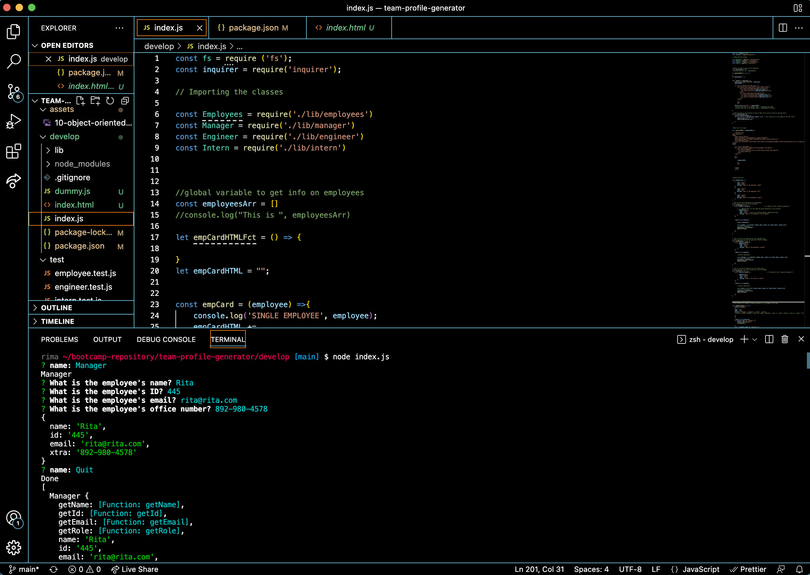

# Team Profile Generator

## License

## Screenshot

## Demonstration: video
[Click here](https://drive.google.com/file/d/1pRdWYrirGRJcSXpDrX50HRDErxSdrMT1/view?usp=sharing)
## Description
This is a team profile generator. It builds a team for the user with three different employee title: Manager, Engineer and Intern. Each employee also has a set of questions that displays more information on them. The user can add as many members as they want. 

## Installation
The first step is to download the app. Once downloaded, use the terminal to run `npm install`. This will download everything the application needs in order to run.

## Usage
After running `npm install`, run this second command to launch the app: `node index.js`. Any data you input after this is up to you. 

## Developer
- Rim Zoungrana
- github.com/Shalah